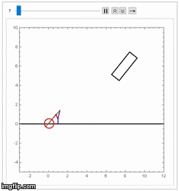

# Simulation of a Non-Linear Dynamic System

This is my final project of [MEGH_ENG 314](http://www.mccormick.northwestern.edu/mechanical/courses/descriptions/314-theory-of-machines-dynamics.html).
It simulates an impact-driven nolinear dynamic system inspired by Angry Bird on Mathematica.

The system consists of

* a slingshot ejecting the ball
* a flying ball
* a falling brick

After running the code, the animation of the system could be viewed:

